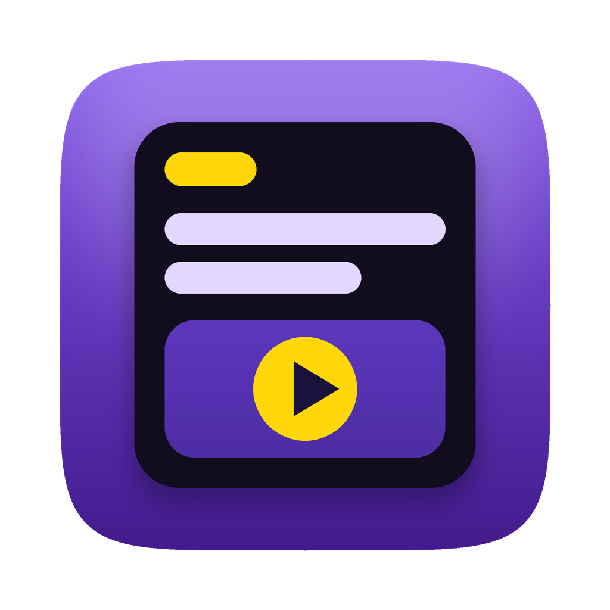

<h1 align="center">Yaikus Studio</h1>

<b>Convierte las noticias de hoy en videos cortos, con tu propia IA.</b> 
App de Mac gratuita y de código abierto para creadores que están empezando y para quien quiere que su agente haga el trabajo pesado.

<a href="../../releases/latest"><b>⬇ Descargar para Mac</b></a> · <a href="README.md">English</a>

---

## Para quién es
**Creadores que empiezan:** eliges una noticia, revisas un guion que sigue *tus* reglas, ves el preview y exportas un MP4 listo para TikTok, Reels, Shorts o YouTube. Sin editor de video ni suscripción.

**Quien trabaja con agentes:** la app incluye un servidor **MCP** local para que Claude, OpenClaw, Hermes, un bot de Grok o tu propio agente lea las noticias y tus reglas, escriba el guion, elija footage y renderice el video, mientras tú decides qué se publica.

## Qué hace
1. **Recopila** feeds RSS o links de artículos en una sola lista.
2. **Elige** la noticia que quieres convertir en video.
3. **Escribe**: tu IA (o tu agente) redacta el guion y la app lo **valida** contra tus reglas (palabras, hook, frases prohibidas, sin links ni hashtags).
4. **Ajusta**: título, hook, guion, fondo y formato, con preview.
5. **Exporta** un MP4 con voz, subtítulos animados y tu fondo. Tú decides dónde publicarlo.

Destacados: reglas editables · vertical 9:16 (TikTok, Reels, Shorts) y horizontal 16:9 (YouTube) · tu IA (Claude, APIs compatibles con OpenAI o un agente por MCP) · tu voz (voz del Mac gratis y sin conexión, OpenAI-compatible o ElevenLabs) · fondos propios o footage libre de Pexels · app nativa sin Python ni ffmpeg · interfaz en español e inglés · sin cuentas ni telemetría, llaves en el Keychain.

## Instalar
1. Descarga el `.dmg` de **[Releases](../../releases/latest)** y arrastra la app a *Aplicaciones*. Requiere macOS 14 o superior.
2. **Primer arranque:** esta versión temprana aún no está notarizada por Apple. macOS la bloqueará una vez: *Ajustes del Sistema → Privacidad y seguridad → Abrir de todos modos*.
3. En la app: agrega una fuente, conecta tu IA, elige una voz y crea tu primer video desde *Noticias*.

## Estado
**v0.1, versión temprana.** Funciona de punta a punta, pero espera detalles por pulir. Límites conocidos: sin notarizar; la versión Intel está compilada pero no probada en hardware real; las integraciones con Pexels y ElevenLabs no se han probado con cuentas reales.

## Hoja de ruta
Versiones notarizadas.

## Licencia
Código: [MIT](LICENSE). El nombre **Yaikus Studio** y el ícono no están cubiertos por la licencia: ver [TRADEMARKS.md](TRADEMARKS.md).
